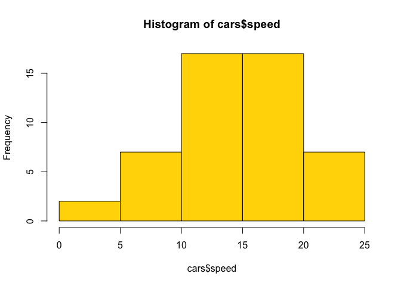
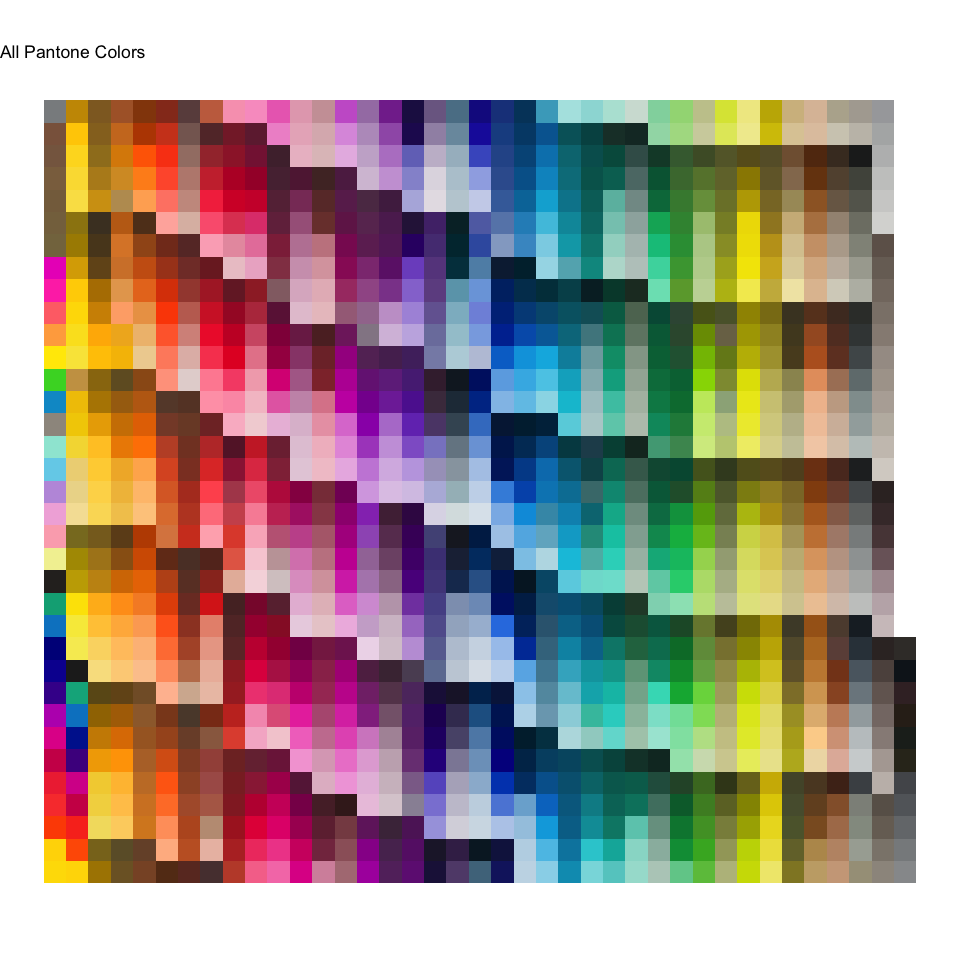

# pantone

<!-- badges: start -->

[](https://CRAN.R-project.org/package=panton)
[](https://www.tidyverse.org/lifecycle/#experimental)
<!-- badges: end -->

The goal of panton is to provide hex values for 1341 Pantone colors
taken from
[https://www.easycalculation.com/colorconverter/pantone-to-hex-table.php](here).

## Installation

You can install the package from [GitHub](https://github.com/) with:

``` r
# install.packages("devtools")
devtools::install_github("pdparker/pantone")
```

## Example

``` r
library(pantone)
data(pantone)
head(pantone)
```

    ##        pantone     hex
    ## 1     Yellow C #fedd00
    ## 2 Yellow 012 C #ffd700
    ## 3 Orange 021 C #fe5000
    ## 4   Warm Red C #f9423a
    ## 5    Red 032 C #ef3340
    ## 6 Rubine Red C #ce0058

``` r
hist(cars$speed, col = pantone[2,2])
```

<!-- -->

``` r
#install.packages("tidyverse")
library(tidyverse)
rep <- data.frame(y = rep(1:35, 39)[1:1341],
                  x = rep(1:39, each = 35)[1:1341],
                  f = factor(1:1341))
bind_cols(pantone, rep) %>%
  ggplot(aes(x,y, fill = f)) + 
  geom_tile() +
  coord_equal()+
  scale_fill_manual(values = pantone$hex[1:1341]) +
  theme_void() +
  theme(legend.position = "none") +
  labs(title = "All Pantone Colors")
```

<!-- -->
